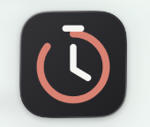
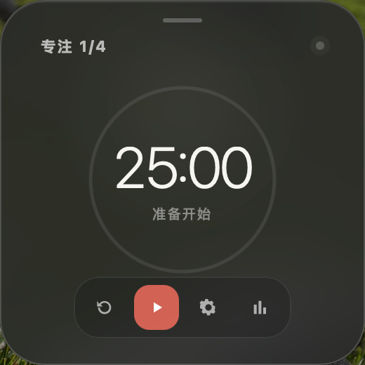
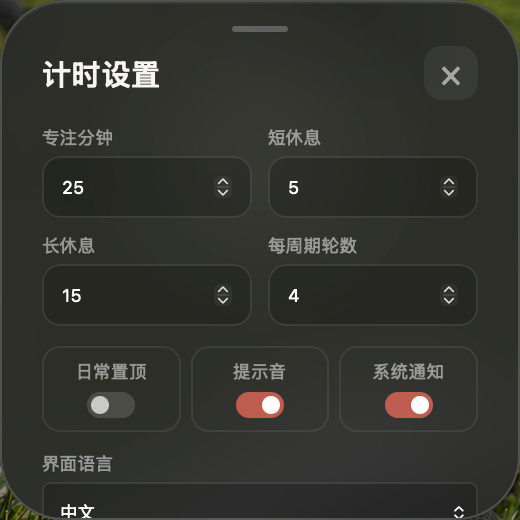
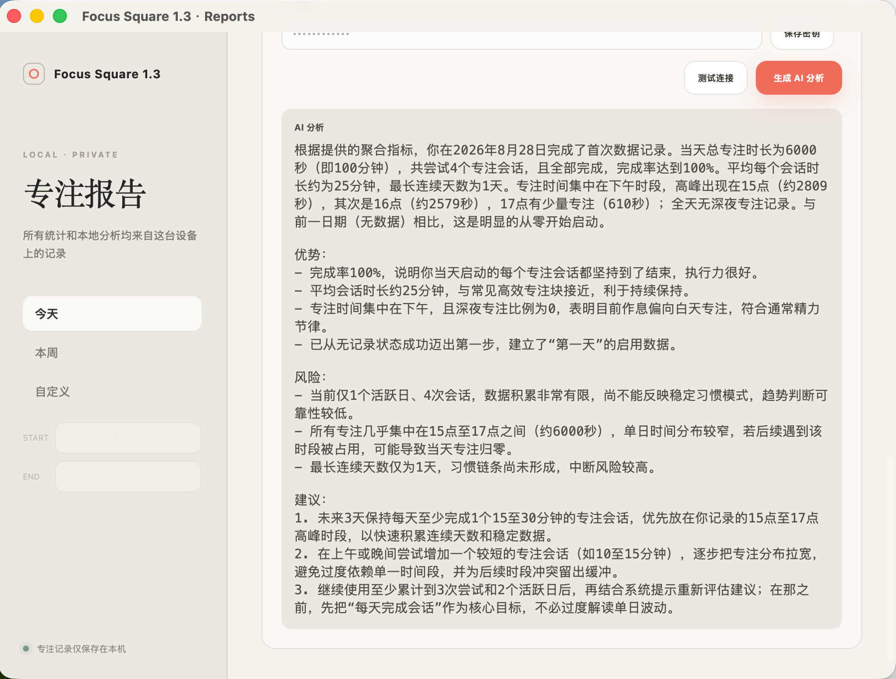
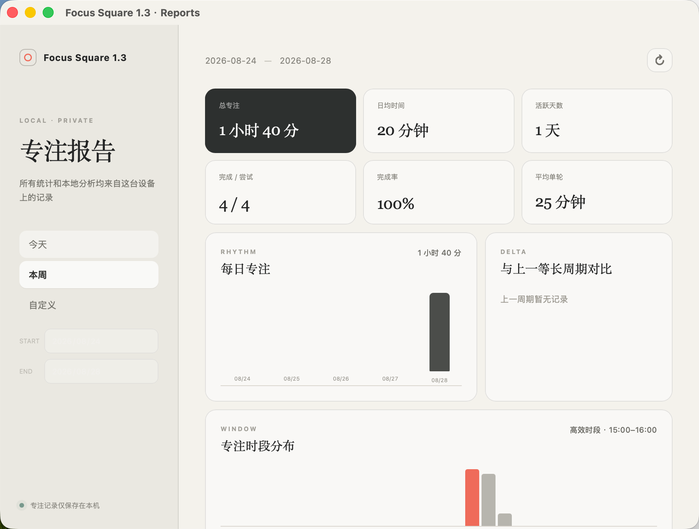

# Tomato Timer（番茄钟） -- Focus Square 1.4.0 -- For Mac
一个轻量、Mac 原生、隐私优先的番茄钟。Focus Square 提供可配置计时、每日/每周/自定义周期统计、本地专注习惯分析和可选的 OpenAI-compatible AI 建议。

<p align="center">
  
</p>

Focus Square is a lightweight, Mac-first, privacy-first Tomato timer with configurable sessions, local focus analytics, and optional OpenAI-compatible advice.

## 功能

- 260×260 半透明桌面计时器，到点放大为 420×420 并抢到前台提醒
<p align="center">
  
</p>

- 可设置专注、短休息、长休息时长和每周期轮数
<p align="center">
  
</p>

- 窗口位置自动保存，关闭后驻留菜单栏或系统托盘
- 本地 SQLite 专注记录及每日、每周、自定义周期报告
<p align="center">
  
</p>

- 可解释的本地习惯分析，无需账号或云服务
- 可选 AI 分析；只发送周期汇总数据，密钥保存在系统凭据库
<p align="center">
  
</p>

- 中文/英文界面, 支持 macOS 12+


## 下载与安装

请从 [GitHub Releases](https://github.com/RoyLuo0328/pomodoro-timer-focus-square-1.4.0-for-mac/releases/latest) 下载最新版，不要从第三方网站获取安装包。

### macOS 12+

1. 下载名称中包含 `universal.dmg` 的文件，Apple Silicon 和 Intel Mac 均可使用。
2. 打开 DMG，将 **Focus Square 1.4** 拖入“应用程序”文件夹。
3. 从“应用程序”打开 Focus Square 1.4。
4. 当前社区版本尚未经过 Apple 公证。如果 macOS 阻止首次启动，请确认文件来自本仓库，然后在 Finder 中按住 Control 点击应用并选择“打开”；也可前往“系统设置 → 隐私与安全性”选择“仍要打开”。

> 当前 v1.4.0 安装包是未签名的 macOS 社区构建。源码公开可审查；正式签名和公证需要 Apple Developer 证书。

## 使用提示

- 拖动窗口顶部短横条可自定义桌面位置，位置会自动保存。
- 关闭主窗口后计时继续运行，可从 macOS 菜单栏重新显示。
- 专注历史保存在本机。AI 分析只在用户主动点击时调用配置的服务。
- API 密钥保存在 macOS Keychain，不写入数据库或日志。

## Install

Download the latest installer from [GitHub Releases](https://github.com/RoyLuo0328/pomodoro-timer-focus-square-1.4.0-for-mac/releases/latest).

- **macOS 12+:** download the universal DMG, drag Focus Square 1.4 to Applications, then open it. The current community build is not notarized, so macOS may require Control-click → Open on first launch.

## 从源码构建

需要 Node.js 24+、Rust stable，以及 [Tauri 2 平台依赖](https://v2.tauri.app/start/prerequisites/)。

```bash
npm install
npm run build
npm test
npm run tauri build
```

开发模式：

```bash
npm run tauri dev
```

## 发布

推送 `v*` 标签会通过 GitHub Actions 创建公开 macOS Release：

- macOS：通用 DMG

未配置签名凭据时会生成未签名社区构建；配置仓库 Secrets 后，工作流会使用 Apple 证书签名。

## 隐私

专注记录仅保存在本地应用数据目录。AI 分析从不自动运行；用户主动调用时，只发送报告级汇总指标和本地分析结论，不发送原始时间戳、数据库记录或设备信息。

## License

MIT
